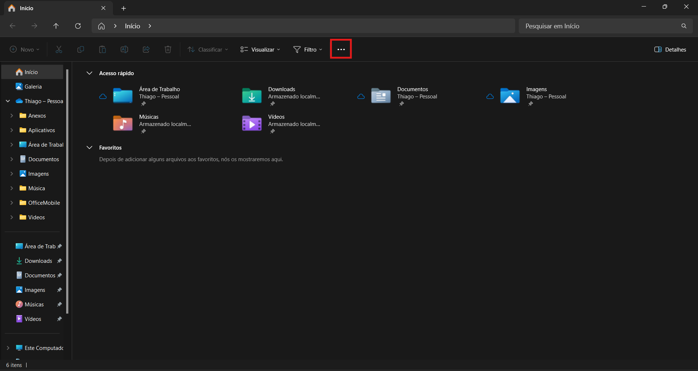
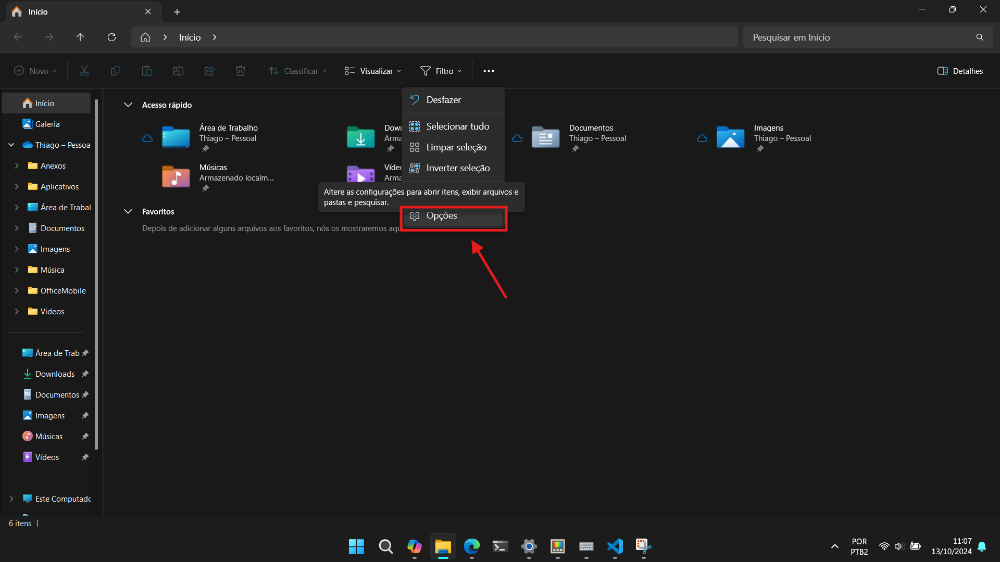
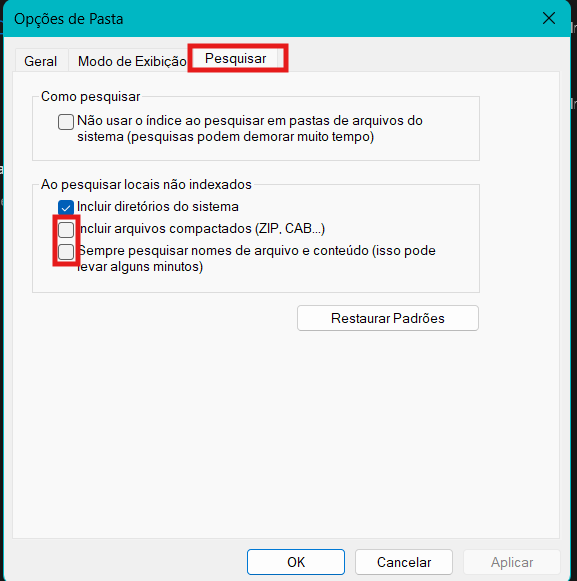
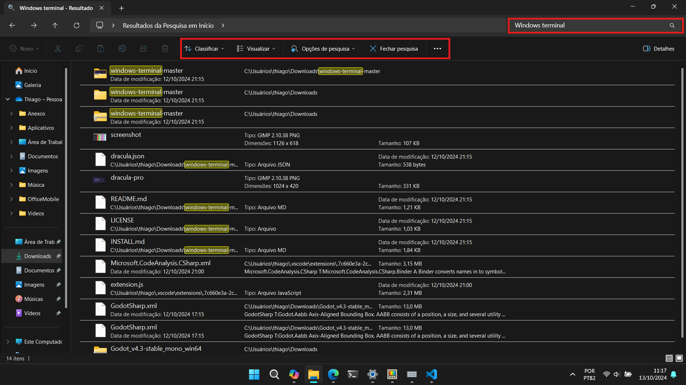
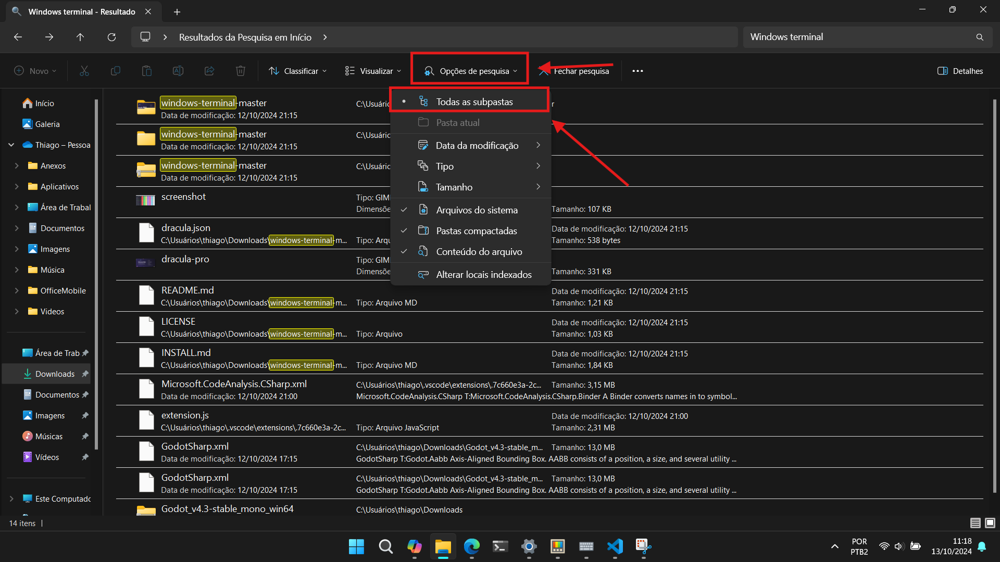
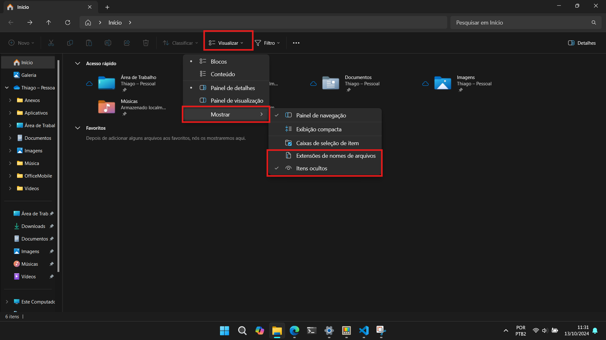
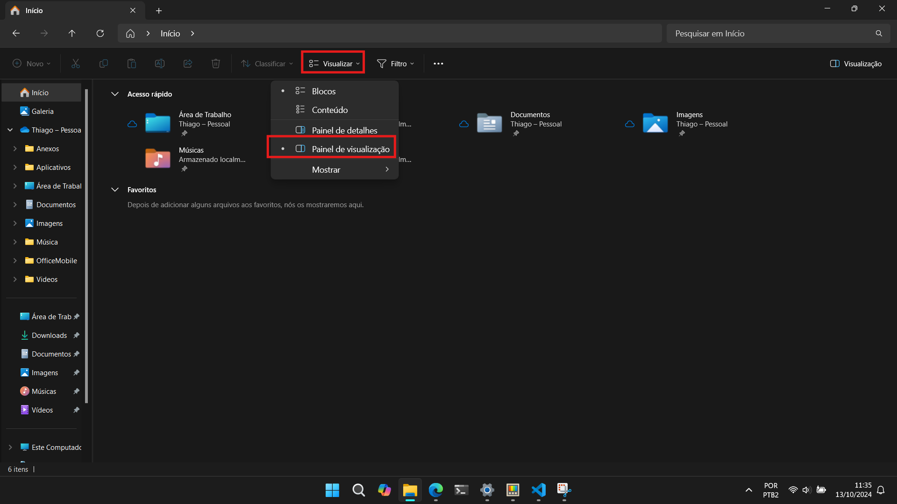
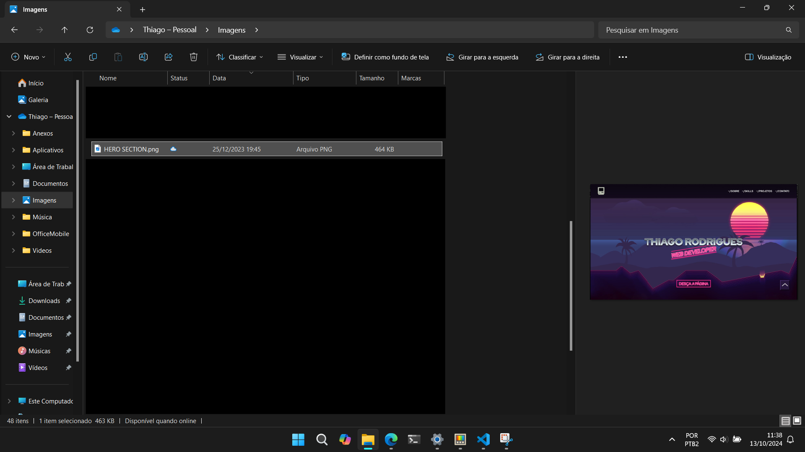

# Setting up advanced file search on Windows

1. Open the File Explorer by pressing `(Win + E)`
2. Click on the three dots (...) icon at the top bar:

3. Select "options": 

4. A new UI will appear with many tabs. Select "search" and mark all options for the "when searching for non-indexed locations":

> __Warning__: Marking those options may cause instability on low-end computers. Use them with caution

5. Use the search bar and search for any file or directory as intended. More options for advanced searching will be shown:

6. Click on "search options", then check the "all subdirectories" option:

7. Back to the usual File Explorer window, select "view" > "show" > "hidden files" and "show file extension" in the top bar:

> __Tip__: If you want a preview of media files such as images, text documents and PDFs, switch from "details panel" to "preview panel":
> 
> After marking this option, every media file you click will provide a preview panel in the right-side of the File Explorer
> 